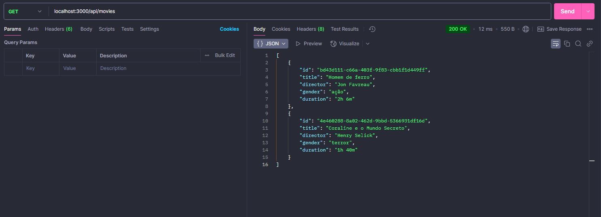
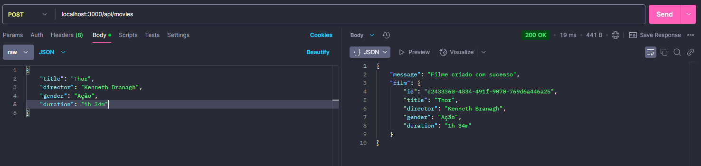
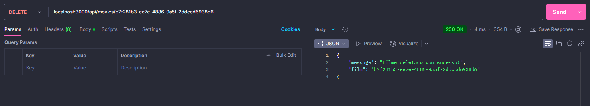
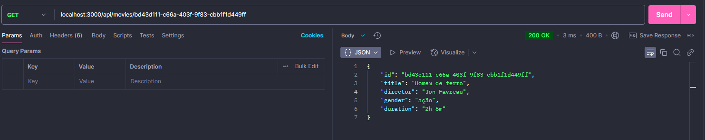

## 👩‍💻 Atividade MVC - Back-end

#### Está é uma atividade desenvolvido no curso técnico de desenvolvimento de sistemas no SENAI Valinhos na matéria de Back-end, com o objetivo de desenvolver um Web Service. É válido ressaltar que o tema deste projeto é relacionado a filmes.

## 💻 Descrição da Atividade

#### A Atividade MVC serve como revisão para o conteúdo de Back-end, com um foco total no desenvolvimento de softwares, estruturação e código limpo. Além também do uso e aprendizagem do formato JSON e XML em Web Services.

## 🚀 Tecnologias Utilizadas

#### <li> JavaScript;
#### <li> Node.js;
#### <li> JSON;
#### <li> XML;
#### <li> Dependências que auxiliam no desenvolvimento: uuid (biblioteca), express, cors e nodemon.

## 📊 UML (Linguagem de modelagem unificada) da Atividade

#### Diagrama UML: 

## 👩‍🚀 Postman 

### GET:

### POST:

### PUT:

### DELETE:

### GET by ID:

## 🖥 XML:

<!-->
<?xml version="1.0" encoding="UTF-8"?>
<dados>
<nome>Homem de ferro</nome>
<director>Jon Favreau</director>
<gender>Ação</gender>
<duration>2h 6m</duration>
</dados>
